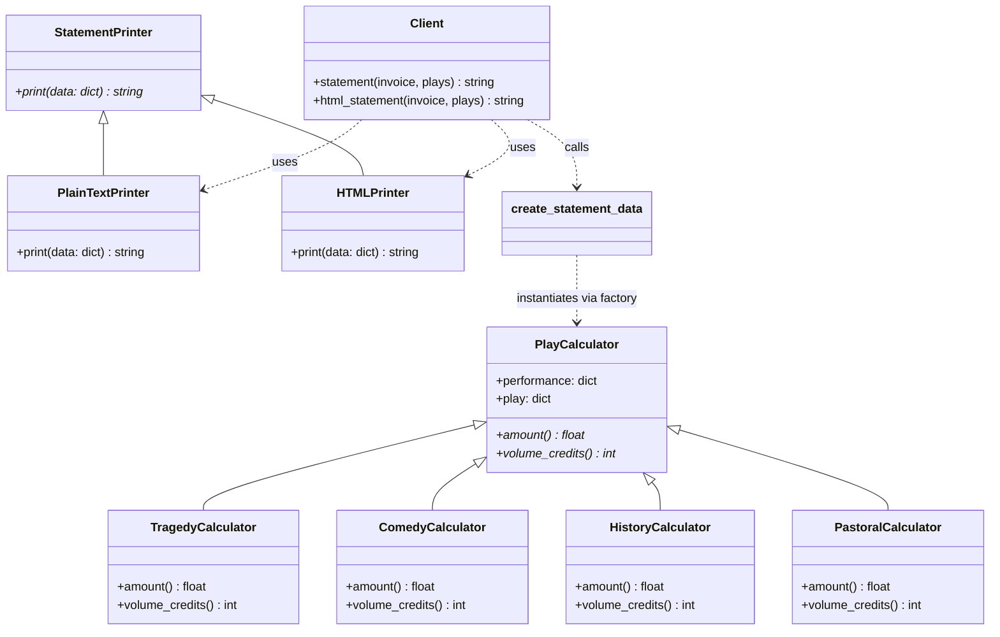

# Informe de Refactorización: Theatrical Players (Python)

Este informe documenta el proceso de refactorización incremental realizado sobre la base de código inicial del proyecto **Theatrical Players** en Python, explicando la justificación técnica de cada decisión tomada con base en la reducción de *code smells*, la aplicación de principios **SOLID** y la implementación de patrones de diseño orientados a objetos.

---

## 1. Mapeo de Code Smells, Técnicas y Principios de Diseño

El código original presentaba un diseño acoplado y monolítico en la función `statement`. Durante la práctica, se atacaron 4 problemas fundamentales:

| # | Code Smell Inicial | Técnica de Refactorización Aplicada | Principios de Diseño / Patrones de Diseño |
|---|---------------------|-------------------------------------|--------------------------------------------|
| **1** | **Método Largo (Long Method)** en la función `statement`. Realizaba cálculo de montos, créditos y renderizado de texto en una sola rutina. | **Extraer Función (Extract Function)**: Se aislaron las responsabilidades en funciones más pequeñas como `amount_for`, `calculate_credits` y `play_for`. | **Principio de Responsabilidad Única (SRP):** Cada función resultante tiene una sola razón para cambiar. |
| **2** | **Variables Temporales Excesivas** (`play`, `this_amount`, etc.) que acumulaban e interferían en la firma de los métodos. | **Reemplazar Temporal con Consulta (Replace Temp with Query)**: Se reemplazaron variables locales llamando a funciones auxiliares directas. | **Facilidad de Lectura y Desacoplamiento:** Permite extraer funciones sin tener que pasar múltiples variables locales como parámetros. |
| **3** | **Falta de Separación de Fases (Mixed Phases)**: El cálculo de la factura y la presentación textual estaban mezclados. | **Dividir Fase (Split Phase)**: Se introdujo una función `create_statement_data` que crea un objeto intermedio (DTO) con los datos calculados. | **Separación de Conceptos (Separation of Concerns):** Independencia absoluta entre la lógica de negocio y la interfaz de presentación. |
| **4** | **Condicionales Repetidos (Repeated Conditionals)** en base al tipo de obra (`tragedy`, `comedy`), lo que dificultaba la extensión a futuros tipos. | **Reemplazar Condicional con Polimorfismo / Patrón Strategy**: Se creó la clase base `PlayCalculator` y subclases concretas por tipo de obra. | **Principio de Abierto/Cerrado (OCP):** El software queda abierto a la extensión (nuevas obras) pero cerrado a la modificación. |

---

## 2. Explicación Detallada de las Refactorizaciones

### Fase 1: Extracción de Funciones Auxiliares (SRP y Reducción de Olores)
El primer paso consistió en delegar las responsabilidades de cálculo dentro de `statement`.
- Se extrajo `calculate_credits(perf, play)` para calcular los puntos acumulados por cada presentación.
- Se extrajo `amount_for(perf, play)` para centralizar las reglas de negocio de facturación de cada tipo de obra.
Esto eliminó el "Método Largo", haciendo que la lógica interna fuera fácil de inspeccionar y validar mediante pruebas unitarias.

### Fase 2: Reemplazo de Variables Temporales (Replace Temp with Query)
Para limpiar el bucle principal de variables temporales que oscurecían el flujo, se extrajo la función `play_for(perf, plays)`. De esta forma, llamadas directas como `play_for(perf, plays)` y `amount_for(perf, play_for(perf, plays))` reemplazaron las asignaciones locales temporales dentro del bucle, permitiendo desacoplar la iteración de la acumulación.

### Fase 3: Introducción del Patrón Strategy para Cálculos
Para cumplir con el principio de Abierto/Cerrado (OCP), la lógica condicional que dependía del campo `play['type']` fue encapsulada utilizando polimorfismo:
- **`PlayCalculator` (Clase Base):** Define la estructura común e interfaces `amount()` y `volume_credits()`.
- **`TragedyCalculator` & `ComedyCalculator` (Clases Concretas):** Implementan las fórmulas específicas para tragedias y comedias.
- **Factory `create_play_calculator`:** Instancia el calculador correspondiente de forma centralizada.

### Fase 4: Dividir Fase (Split Phase) y Strategy para Formatos (HTML y Plain Text)
La necesidad de generar la factura tanto en formato texto plano como en HTML requería separar el cálculo de datos del formateo de salida.
1.  **`create_statement_data`:** Toma la entrada bruta (invoice, plays) y genera un diccionario estructurado intermedio enriquecido, resolviendo montos y créditos.
2.  **`StatementPrinter` (Clase Base):** Define la interfaz para los formatos.
3.  **`PlainTextPrinter` & `HTMLPrinter` (Clases Concretas):** Consumen el objeto intermedio y dan formato.
4.  **`html_statement` & `statement`:** Funciones de entrada del cliente que asocian el generador de datos con la estrategia de impresión correspondiente.

---

## 3. Diagrama del Diseño Final (Mermaid)

El siguiente diagrama de clases muestra la arquitectura final implementada. La lógica de cálculo polimórfica está desacoplada de la lógica de renderizado gracias al objeto de datos intermedio `StatementData`.

---

## 4. Evidencia de Extensibilidad (OCP): Nuevos Tipos de Obra
Para demostrar la alta calidad y mantenibilidad del diseño final (cumpliendo con la Tarea 6), se añadieron con facilidad dos nuevos tipos de obras: `"history"` (historia) y `"pastoral"` (pastoral).
Gracias a la refactorización polimórfica:
1.  **No se modificó ninguna clase existente** (Tragedy, Comedy, PlainTextPrinter, etc.).
2.  Solo se crearon dos nuevas subclases: `HistoryCalculator` e `PastoralCalculator`.
3.  Se registró su instanciación en la factory `create_play_calculator`.
Esto confirma que el código es extremadamente robusto y extensible.

---

## 5. Conclusión
El proceso de refactorización transformó una función legacy acoplada y propensa a errores en una biblioteca orientada a objetos moderna, modular, altamente testeable (con una cobertura completa de pruebas unitarias sobre cada calculador e impresor) y que sigue fielmente las mejores prácticas de la ingeniería de software como los principios SOLID de Martin Fowler.
